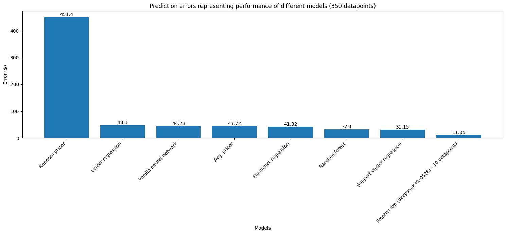

# Model comparison results

After training on approximately 3000 items, following are the error/diff results of different models on 350 datapoints.

(LLM results coming soon, not included as of now due to Rate Limit issues)

